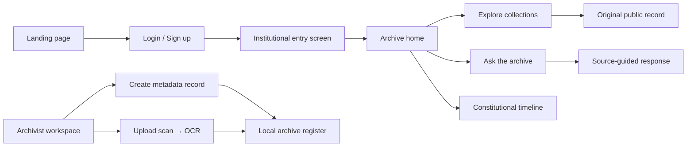
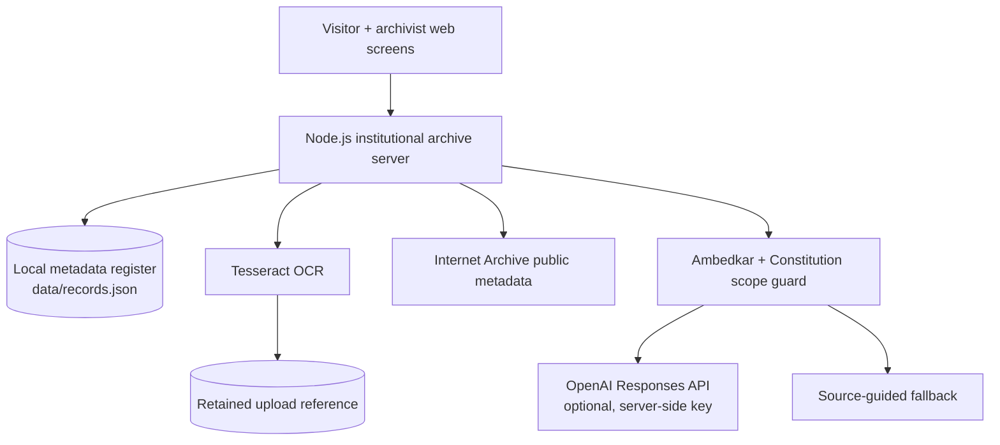

# Samvidhan Heritage Archive

> **A digital museum, research library and source-guided AI assistant for Dr. B. R. Ambedkar and India’s constitutional heritage.**

Samvidhan Heritage Archive responds to Smart India Hackathon Problem Statement **26096**: *Digital Heritage Archive for Memorials, Manuscripts & Ambedkar*. It transforms fragmented writings, speeches, constitutional debates, manuscripts, photographs and audio-visual records into one accessible institutional experience.

The prototype is designed for an institution such as the Dr. Ambedkar International Centre: visitors can discover collections through a calm museum-inspired interface, researchers can inspect structured records, and archivists can digitise and catalogue new material.

## Why this matters

Ambedkar’s intellectual and constitutional legacy is distributed across libraries, memorials and disconnected collections. This makes it hard to discover, verify, preserve and learn from the material. This project makes that heritage:

- **Discoverable** — unified collection browsing, search-led exploration and a constitutional timeline.
- **Understandable** — concise research pathways and a strictly scoped archive assistant.
- **Preservable** — OCR-assisted digitisation, metadata capture and local archival records.
- **Trustworthy** — live public-record links lead back to the original preservation source; the demo explicitly tells visitors to verify original records.
- **Inclusive by design** — a multilingual-ready interface (English, Hindi and Marathi labels) and a clear path to narration/translation modules.

## Experience at a glance



## Problem statement → working solution

| Problem-statement need | What this prototype demonstrates |
| --- | --- |
| Centralised digital archive | A single dashboard for writings, speeches, debates, manuscripts, visual records and constitutional material. |
| AI-powered semantic/research support | `POST /api/ask` has a hard Ambedkar-and-Constitution scope guard, source-aware instructions and a safe no-key fallback. |
| OCR digitisation | Archivists can upload JPG/PNG scans; the server runs Tesseract and returns extractable text plus a retained scan reference. |
| Metadata tagging and archival management | The institutional workspace creates and persists structured records in the archive register. |
| Audio-video and visual preservation | Collection pathways explicitly surface audio-visual and photographic material, alongside external original-record links. |
| Interactive historical learning | A dedicated timeline and collection journeys connect landmark events, writings and constitutional debates. |
| Public access to trusted records | Live Ambedkar-related metadata is fetched from Internet Archive and links visitors to the original public record. |
| Multilingual / accessible learning | The interface exposes English, Hindi and Marathi language affordances; the architecture keeps content and display separate for future translation and narration services. |

## Core features

### For visitors, students and researchers

- Museum-like landing, authentication and archive-entry journey.
- Minimal “Ask the archive” workspace instead of a text-heavy dashboard.
- Curated starting points for writings, speeches, manuscripts and the historical timeline.
- Collection browsing across books, debates, manuscript documents, audio-visual material, photographs and constitutional records.
- Live Ambedkar-related public metadata from Internet Archive, with a direct route to the source item.
- A visible prototype notice so demo content is never confused with an authoritative record.

### For archivists and institutions

- Institutional workspace for adding catalogue records.
- Persistent JSON-backed archive register for the prototype.
- OCR workflow for scanned JPG and PNG documents.
- Upload validation, size limits and temporary OCR processing.
- Foundation for role-based archival workflows, preservation storage and richer metadata standards.

### Source-guided research assistant

The assistant is deliberately **not a generic chatbot**. It accepts only questions about Dr. B. R. Ambedkar, his writings and legacy, the Constitution of India, constitutional rights and constituent debates. It declines unrelated topics.

When `OPENAI_API_KEY` is available, the server sends only the question plus constrained archive context to the OpenAI Responses API and instructs the model to avoid invented facts, quotations, dates or holdings. When an API key is not configured or the service is unavailable, the application still returns deterministic source-guided answers for the demo.

## Architecture



### Data and trust model

1. **Discovery data** — Internet Archive metadata is retrieved live and linked back to its original public record.
2. **Institutional data** — records created by an archivist are stored in the local archive register.
3. **Digitised data** — a scan is retained locally and its OCR output is returned for archival review.
4. **AI output** — answers are bounded by an archive-only scope, use supplied context and guide users to a source path. They are not a substitute for reading the original record.

## Technical stack

- **Frontend:** semantic HTML, responsive CSS and vanilla JavaScript.
- **Backend:** dependency-free Node.js HTTP server.
- **OCR:** Tesseract.
- **Live discovery:** Internet Archive Advanced Search API.
- **Optional research AI:** OpenAI Responses API, called only from the server.
- **Storage (prototype):** JSON metadata register and local scan references.

## Local setup

### Requirements

- Node.js 18 or later (uses native `fetch`, `Request` and `FormData`).
- Tesseract OCR for document digitisation.

### Run the platform

```bash
git clone https://github.com/SahinS14/Samvidhan-Heritage-Archive.git
cd Samvidhan-Heritage-Archive
node server.js
```

Open [http://127.0.0.1:4173](http://127.0.0.1:4173).

### Hosted preview

The hosted deployment uses an edge-compatible archive service for the visitor-facing experience: live Internet Archive discovery and the scope-controlled research assistant. Native Tesseract OCR and local catalogue writes remain on the institutional archive server, where scans and preservation storage are managed. This keeps the public discovery experience fast while protecting archival operations behind the institution’s server boundary.

### Optional configuration

```bash
export OPENAI_API_KEY="your_key_here"
export OPENAI_MODEL="gpt-6-astra"
export TESSERACT_BIN="/usr/bin/tesseract"
node server.js
```

Never commit an API key. The `.gitignore` excludes `.env` and uploaded scans. If no OpenAI key is configured, the source-guided fallback keeps the demo functional.

## API reference

| Endpoint | Method | Purpose |
| --- | --- | --- |
| `/api/health` | `GET` | Service health check. |
| `/api/records` | `GET` | Read institutional archive records. |
| `/api/records` | `POST` | Add a validated institutional record. |
| `/api/live-records?q=Ambedkar` | `GET` | Fetch recent Ambedkar-related public metadata from Internet Archive. |
| `/api/digitize` | `POST` | Upload a JPG/PNG scan for OCR. |
| `/api/ask` | `POST` | Ask the constrained Ambedkar/Constitution research assistant. |

## Repository guide

| File / folder | Purpose |
| --- | --- |
| `index.html` | Public landing page. |
| `login.html`, `signup.html` | Entry authentication screens. |
| `pre.html` | Institutional transition screen. |
| `archive.html` | Visitor archive dashboard, collections, timeline and research assistant. |
| `admin.html` | Archivist workspace and digitisation flows. |
| `server.js` | API, OCR orchestration, live discovery and static server. |
| `data/records.json` | Prototype institutional catalogue register. |
| `assets/` | Heritage visual assets used by the interface. |

## Roadmap: from prototype to institutional deployment

- Replace JSON storage with a secured archival database and object storage.
- Adopt Dublin Core / MODS metadata, authority controls and versioned preservation records.
- Add verified transcripts, multilingual translation and human-reviewed audio narration.
- Connect a vector index to institution-approved material for citation-level retrieval.
- Add role-based access, audit trails, consent controls and preservation backups.
- Deploy kiosk mode, accessible touch interfaces and large-screen memorial storytelling.

## A note for judges

This is not just a visual archive concept. The working prototype demonstrates the complete core loop required by the problem statement:

**discover a public record → study a collection → ask a constrained research question → digitise a new scan → catalogue it for future researchers.**

It is built as a practical foundation for an institutional, trustworthy and accessible digital heritage platform that brings Ambedkar’s ideas closer to students, researchers and the public.
